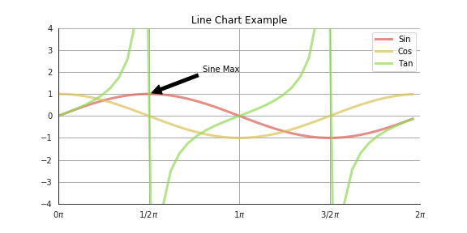
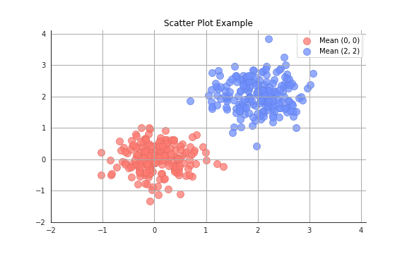
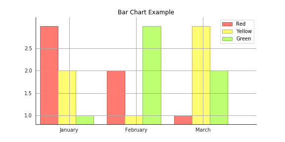

# PewDiePlot

PewDiePlot is a high-level API for Pyplot to easily create beautiful graphs.

## Examples

All examples can be found as Jupyter notebooks in the [examples](https://github.com/floscha/pewdieplot/tree/master/examples) folder.

### Line Chart Example
```python
(LineChart('Line Chart Example', size=(8, 5))
 .xlabel_fn(lambda n: r'$%s\pi$' % Fraction(n / np.pi))
 .legends(['Sine', 'Cosine', 'Tangent'])
 .data(all_points)
 .pyplot('annotate', 'Sine Max', xy=(0.5 * np.pi, 1), xytext=(2.5, 2),
         arrowprops=dict(facecolor='black', shrink=0.05))
 ).show()
```



### Scatter Plot Example
```python
(ScatterPlot(title='Scatter Plot Example', size=(8, 5))
 .legends(['Mean (0, 0)', 'Mean (2, 2)'])
 .data(all_points)
 ).show()
```



### Bar Chart Example
```python
(BarChart(title='Bar Chart Example', size=(8, 5))
 .xlabel_fn(lambda n: x_tick_labels[n])
 .legends(['Red', 'Yellow', 'Green'])
 .data(data)
 ).show()
```




## Build

From the root folder of the project, simply install using:

```
$ pip install .
```

Then in your Python code simply import using:

```python
import pewdieplot
```
