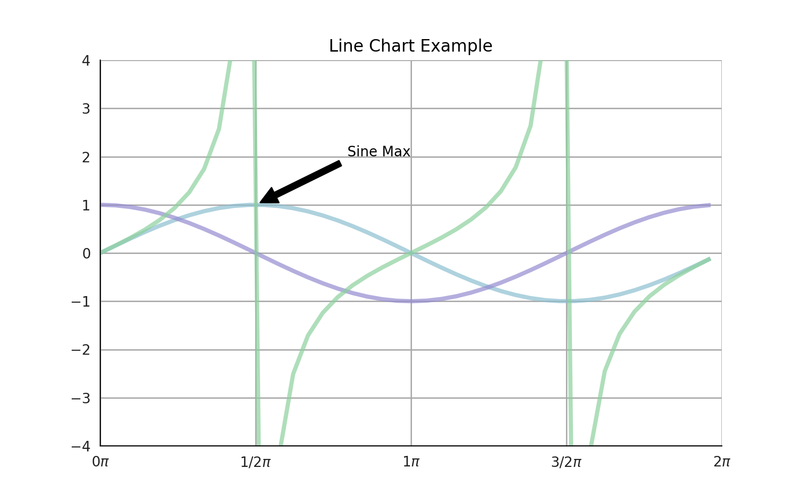
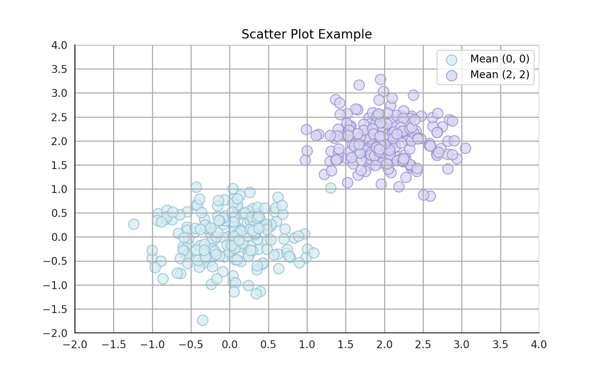

# PewDiePlot

PewDiePlot is a high-level API for Pyplot to easily create beautiful graphs.

## Examples

### Line Chart Example
```python
(LineChart('Line Chart Example', size=(8, 5))
 .xlim(0, 2 * np.pi)
 .ylim(-4, 4)
 .xticks(np.arange(0, 2 * np.pi + 0.1, 0.5 * np.pi))
 .yticks(np.arange(-5, 5, 1))
 .xlabel_fn(lambda n: r'$%s\pi$' % Fraction(n / np.pi))
 .legends(['Sine', 'Cosine', 'Tangent'])
 .data(all_points)
 .pyplot('annotate', 'Sine Max', xy=(0.5 * np.pi, 1), xytext=(2.5, 2),
         arrowprops=dict(facecolor='black', shrink=0.05))
 ).show()
```



### Scatter Plot Example
```python
(ScatterPlot(title='Scatter Plot Example', size=(8, 5))
 .xlim(-2, 4)
 .ylim(-2, 4)
 .xticks(np.arange(-2, 4.5, 0.5))
 .yticks(np.arange(-2, 4.5, 0.5))
 .legends(['Mean (0, 0)', 'Mean (2, 2)'])
 .data(all_points)
 ).show()
```


